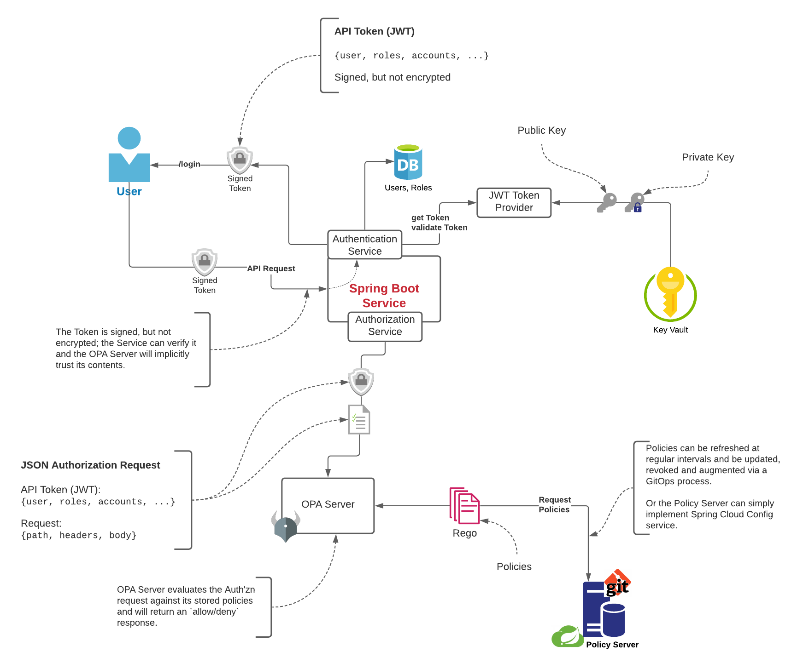

# Integrating Open Policy Agent (OPA) with Spring Security Reactive and JSON Web Tokens (JWT)


[](https://bitbucket.org/marco)
[](https://opensource.org/licenses/Apache-2.0)


# Motivation

[Spring Security](https://spring.io/projects/spring-security) assumes a fairly simplistic Role-Based access control (RBAC) where the service authenticates the user (via some credentials, typically username/password) and returns a `UserDetails` object which also lists the `Authorities` that the `Principal` has been granted.

While it is also possible to integrate Spring Security with JSON Web Tokens ([JWT](https://auth0.com/docs/tokens/json-web-tokens)) this is also rather cumbersome, and lacks flexibility.

Finally, integrating the app with an [Open Policy Agent](https://play.openpolicyagent.org/) server for the relatively new [Spring Reactive](https://projectreactor.io/docs/core/release/reference) (`WebFlux`) model is far from straightforward.

Ultimately, however, Spring Security "collapses" authentication and authorization into a single process, based on the `UserDetails` abstraction, which sometimes does not allow sufficient flexibility.

This library aims at simplifying the ability for an application/service to:

- clearly separating **authentication** from **authorization**;
- easily adopt JWTs (API Tokens) as a means of **authentication**;
- simplify integration with OPA for **authorization**;
- keeping the authorization logic (embedded in [Rego](https://www.openpolicyagent.org/docs/latest/policy-reference) policies) separate from the business logic (carried out by the application).

It also provides a blueprint to inject OPA authorization in a Spring Reactive (WebFlux) application.

# Architecture



To acquire an API Token the client needs to access one of the "authenticated" endpoints (as defined in the `routes.authenticated` list property - see the `RoutesConfiguration` class) and obtain a valid JWT from the `JwtTokenProvider`; an example of how to do this (using a simple Spring Data repository, backed by MongoDB) is in the `/login` controller in the example app (`LoginController`): the `SecurityConfiguration` class is what one would implement in any Spring Application with Spring Security enabled:

```java
@Configuration
@EnableWebFluxSecurity
public class SecurityConfiguration {
  @Bean
  public ReactiveUserDetailsService userDetailsService(ReactiveUsersRepository repository) {
    return username -> {
      return repository.findByUsername(username)
          .map(User::toUserDetails);
    };
  }
}
```

Obviously, instead of accessing a local database, the application could use a `WebClient` to access a remote service to retrieve any details (including an encoded password).

Once the user has been authenticated, we can generate a JWT API Token, and return it to the client:

```java
@GetMapping
Mono<JwtController.ApiToken> login(
    @RequestHeader("Authorization") String credentials
) {
  return usernameFromHeader(credentials)
      .flatMap(repository::findByUsername) // See Note.
      .map(u -> {
        String token = provider.createToken(u.getUsername(), u.roles());
        return new JwtController.ApiToken(u.getUsername(), u.roles(), token);
      })
      .doOnSuccess(apiToken ->
          log.debug("User {} authenticated, API Token generated: {}",
              apiToken.getUsername(), apiToken.getApiToken()));
}
```

<sup>**Note**</sup><sub>As you may notice, we are duplicating the roundtrip to the DB for the `User` data; this may (or may not) be a performance issue, especially on performance-sensitive APIs: an obvious solution would be to use either a co-located cache, or even an in-memory one, with a relatively short TTL.</sub>

### Authorization via Open Policy Agent server

More interestingly, once the client has an API Token, it can be used to authorize any other request: this is done by configuring the `OpaReactiveAuthorizationManager` as a `ReactiveAuthorizationManager` (this is "chained" via the `JwtReactiveAuthorizationManager`) which takes care of validating the API Token.

All of this is done transparently by the `jwt-opa` library, without having to change anything in the actual application.

```java
@Override
public Mono<AuthorizationDecision> check(
    Mono<Authentication> authentication,
    ServerHttpRequest request
) {

  return authentication.map(auth -> {
        return makeRequestBody(auth.getCredentials().toString(), request);
      })
      .flatMap(body -> client.post()
          .accept(MediaType.APPLICATION_JSON)
          .contentType(MediaType.APPLICATION_JSON)
          .bodyValue(body)
          .exchange())
      .flatMap(response -> response.bodyToMono(Map.class))
      .map(res -> {
        Object result = res.get("result");
        if (StringUtils.isEmpty(result)) {
          return Mono.error(unauthorized());
        }
        return result.toString();
      })
      .map(o -> Boolean.parseBoolean(o.toString()))
      .map(AuthorizationDecision::new);
}
```
<sup>**Simplified code excerpt, please see the OpaReactiveAuthorizationManager class for the full code**</sup>

the `client` is a Spring `WebClient` configured to connect to the OPA Server as configured via the `OpaServerConfiguration` configuration, which reads the following properties from `application.yaml`:

```yaml
opa:
  server: "localhost:8181"
  policy: kapsules
  rule: allow
```

This will eventually send a `TokenBasedAuthorizationRequestBody` (encoded as JSON) to the following endpoint:

    http(s)://localhost:8181/v1/data/kapsules/allow

Depending on what the `allow` rule maps to, this will eventually grant/deny access to the requested endpoint (given the HTTP Method and, optionally, the request's body content).

See [OPA Policies](#opa-policies) for what this maps to, and the [OPA Documentation](https://www.openpolicyagent.org/docs/latest/policy-reference) for more details on Rego and the server REST API.


# Running

## Generating a `KeyPair`

Use the `keygen.sh` script, specifying the name of the keys and, optionally, a folder where to save the keys (if the folder doesn't exist it will be created):

    $ ./keygen.sh  ec-key private

See [this](https://github.com/auth0/java-jwt/issues/270) for more details.

Briefly, an "elliptic cryptography" key pair can be generated with:

1. generate the EC param

        openssl ecparam -name prime256v1 -genkey -noout -out ec-key.pem

2. generate EC private key

        openssl pkcs8 -topk8 -inform pem -in ec-key.pem -outform pem \
            -nocrypt -out ec-key-1.pem

3. generate EC public key

        openssl ec -in ec-key-1.pem -pubout -out public.pem

Save both keys in a `private` folder (not under source control) and then point the relevant application configuration (`application.yaml`) to them:

```yaml
secrets:
  keypair:
    private: "private/ec-key-1.pem"
    pub: "private/ec-key-pub.pem"
```

You can use either an absolute path, or the relative path to the current directory from where you are launching the Web server.


## Supporting Services

The sample app (`jwt-vault`) uses the following services:

  - Mongo (users DB);
  - OPA Policy Server; and
  - Hashicorp Vault (key store) -- `TODO:` we are currently storing keys on disk

Use the following to run the servers locally:

```
docker run --rm -d -p 27017:27017 --name mongodb mongo:3.7
docker run --rm -d -p 8181:8181 --name opa openpolicyagent/opa run --server
# TODO: Vault container
```

`TODO:` a full Kubernetes service/pod spec to run all services.

## Web Server (Demo app)

This is a very simple Spring Boot application, to demonstrate how to integrate the `jwt-opa` library; there is still some work to refine it, but by and large, it gives a good sense of what is required to integrate a Spring Boot app with an OPA server:

1. implement a `SecurityConfiguration` `@Configuration` class;
2. implement a mechanism to retrieve `UserDetails` given a `username`; and
3. implement something similar to the `LoginController` to serve API Tokens to authenticated users.

In future releases of the `jwt-opa` library we may also provide "default" implementations of some or all of the above, if this can be done without limiting too much client's options; or maybe they could be provided in a `jwt-opa-starter` extension library.

`TODO:` there are stil a few rough edges in the demo app and its APIs.

### Trying out the demo


After starting the server (`./gradlew bootRun`), you will see in the log the generated password
for the `admin` user:

    INFO Initializing DB with seed user (admin)
    INFO Use the generated password: 342dfa7b-4


**Note**
> The system user does not get re-created, if it already exists: if you lose the random password, you will need to manually delete it from Mongo directly:

```
docker exec -it mongo mongo
> show dbs;
...
opa-demo-db  0.000GB
> use opa-demo-db
> db.users.find()
{ "_id" : ObjectId("5ff8173b20953c451f10a384"), "username" : "admin", ...
> db.users.remove(ObjectId("5ff81..."))
```
> and then restart the server to recreate the admin user.
> Alternatively, just stop & restart the Mongo container (but all data will be lost).

To access the `/login` endpoint, you will need to use `Basic` authentication:

    $ http :8080/login --auth admin:342dfa7b-4

this will generate a new API Token, that can then be used in subsequent HTTP API calls, with the `Authorization` header:

    http :8080/users Authorization:"Bearer ... JWT goes here ..."


# OPA Policies

They are stored in `src/main/rego` and can be uploaded to the OPA policy server via a `curl POST` (see `REST API` in [Useful Links](useful-links#)); examples of policy evaulations are in `src/test/policies_tests` as JSON files; they can be executed against the policy server using the `/data` endpoint:


    POST http://localhost:8181/v1/data/kapsules/valid_token

    {
      "input": {
          "user": "myuser",
          "role": "USER",
          "token": "eyJ0eXAi....iCzY"
      }
    }


### Useful links

1. [REGO Playground](https://play.openpolicyagent.org/)
1. [OPA Server REST API for Data](https://www.openpolicyagent.org/docs/latest/rest-api/#data-api)
1. [OPA Documentation](https://www.openpolicyagent.org/docs/latest/)
1. [OPA - How does it work](https://www.openpolicyagent.org/docs/latest/philosophy/#how-does-opa-work)
1. [OPA Policy Reference](https://www.openpolicyagent.org/docs/latest/policy-reference/)
1. [Docker Hub - OPA image](https://hub.docker.com/r/openpolicyagent/opa)
